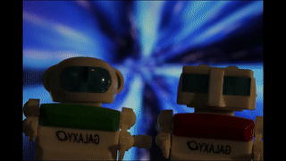

# DSLR Photobox

This project contains a simple application that realizes a "photo box".
The app will show the live preview of a (Canon) DSLR in a Qt window.

When the user presses a button, a picture will be taken and shown for 10 seconds, as well as saved in the raw format.



Note: This project is a rather old, private project of mine and no longer maintained. Therefore, documentation is largely missing.

Also note: Tests with Ubuntu 20, GCC 8 and a Canon 500D were successfully tested at the time this retrospective documentation was written.

## Dependencies

The following system dependencies are required:

* [https://github.com/LibRaw/LibRaw](LibRaw) cloned to a local path
* Qt5
* Gphoto2
* Boost (system)

## Building

```bash
mkdir build
cd build
cmake .. -DLIBRAW_PATH=<path-to-your-libraw-checkout>
```

## Running

```bash
cd build
./photobox <path-to-put-images-to>
```
